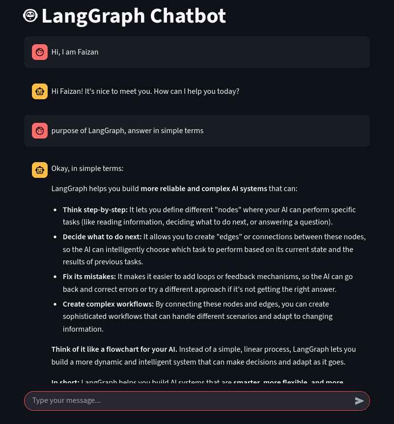

# LangGraph Chatbot (Streamlit Frontend)

This is a simple chatbot built with **LangGraph** and **Google Gemini** as the LLM, with a **Streamlit** interface for chatting in the browser.
It’s intended for local use and small-scale demos, not large-scale production.

## GUI

---

## Features

* Simple, clean chat interface in the browser.
* Powered by LangGraph for conversation flow.
* Uses Google Gemini for generating responses.
* Keeps conversation history during the session.
* Can be accessed from other devices on the same local network.

---

## Installation

1. **Clone the repository**

   ```bash
   git clone https://github.com/yourusername/langgraph-chatbot.git
   cd langgraph-chatbot
   ```

2. **Install dependencies**

   ```bash
   pip install -U streamlit langgraph langsmith python-dotenv
   ```

3. **Set up environment variables**
   Create a `.env` file in the project root and add:

   ```env
   GOOGLE_API_KEY=your_google_api_key
   ```

   You can get your API key from [Google AI Studio](https://aistudio.google.com/app/apikey).

---

## Usage

Run the chatbot locally:

```bash
streamlit run app.py
```

You’ll see something like:

```
Local URL: http://localhost:8501
Network URL: http://192.168.x.x:8501
```

Open the **Local URL** if you’re using the same machine.
Open the **Network URL** on other devices connected to the same Wi-Fi/LAN.

---

## Access from Local Network

If you want other devices in your network to access it:

```bash
streamlit run app.py --server.address 0.0.0.0 --server.port 8501
```

Then visit:

```
http://<your-lan-ip>:8501
```

Example:

```
http://192.168.0.101:8501
```

### Notes:

* Make sure your firewall allows inbound TCP on port **8501**.
* Some routers block device-to-device communication (AP isolation).
* This app is not secured with authentication — don’t expose it to the public internet.

---

## Limitations

* Session history is reset when the app restarts.
* Requires a working Google API key.
* Not optimized for heavy production workloads.

---