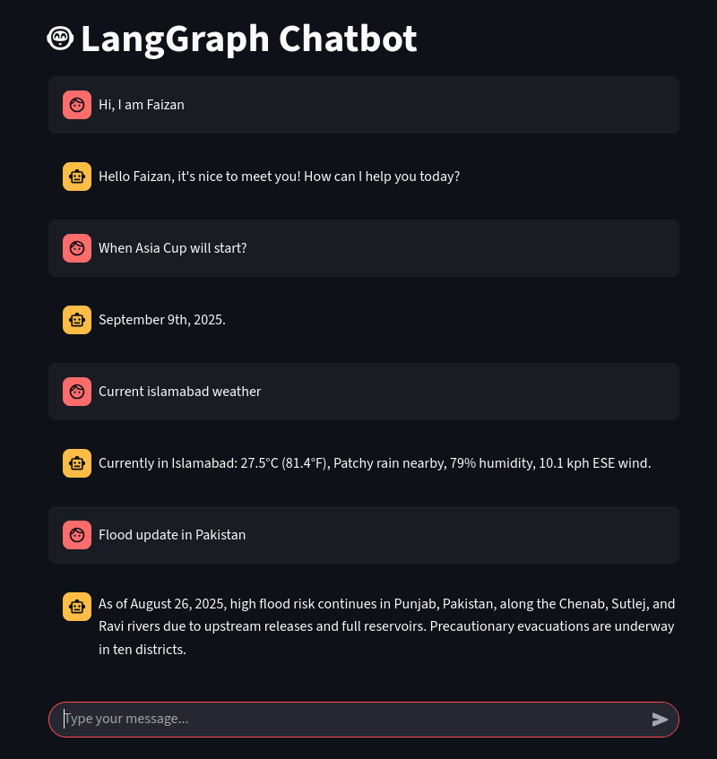

# LangGraph Chatbot (Streamlit Frontend)

This is a chatbot built with **LangGraph** and **Google Gemini** as the LLM, with a **Streamlit** interface for chatting in the browser.

It features an intelligent router to decide when to perform a web search for up-to-date information and saves conversation history so you can pick up where you left off.

## GUI

---

## Features

*   **Intelligent Web Search**: A router analyzes user queries to intelligently decide whether a web search is required for the most current and relevant answers.
*   **Persistent Conversation History**: Uses thread-based persistence, so conversation history is saved. You can continue your chat even after closing the browser or restarting the app.
*   **Advanced Logic with LangGraph**: Powered by LangGraph to create a flexible, stateful conversation flow.
*   **Google Gemini LLM**: Uses Google Gemini for generating high-quality, conversational responses.
*   **Simple Web Interface**: A clean and simple chat interface built with Streamlit.
*   **Local Network Access**: Can be accessed from other devices on the same local network.

---

## Installation

1.  **Clone the repository**

    ```bash
    https://github.com/muhammad-faizan-122/chatbot.git
    cd chatbot
    ```

2.  **Install dependencies**
    Ensure your `requirements.txt` includes `langchain-community` and `tavily-python`, then install:
    ```bash
    pip install -r requirements.txt
    ```

3.  **Set up environment variables**
    Create a `.env` file in the project root and add your API keys:

    ```env
    GOOGLE_API_KEY=your_google_api_key
    TAVILY_API_KEY=your_tavily_search_api_key
    ```

    *   You can get your free Google API key from [Google AI Studio](https://aistudio.google.com/app/apikey).
    *   You can get a free Tavily API key from the [Tavily website](https://tavily.com/).

---

## Usage

Run the chatbot locally:

```bash
streamlit run app.py
```

You’ll see something like:

```
Local URL: http://localhost:8501
Network URL: http://192.168.x.x:8501
```

Open the **Local URL** if you’re using the same machine.
Open the **Network URL** on other devices connected to the same Wi-Fi/LAN.

---

## Access from Local Network

If you want other devices in your network to access it:

```bash
streamlit run app.py --server.address 0.0.0.0 --server.port 8501
```

Then visit:

```
http://<your-lan-ip>:8501
```

Example:

```
http://192.168.0.101:8501
```

### Notes:

*   Make sure your firewall allows inbound TCP on port **8501**.
*   Some routers block device-to-device communication (AP isolation).
*   This app is not secured with authentication — don’t expose it to the public internet.

---

## Limitations

*   Requires working API keys for Google and Tavily.
*   Not optimized for heavy production workloads.
*   The default persistence is in-memory or local; for scaled deployment, a more robust database (like Postgres) would be needed.

---