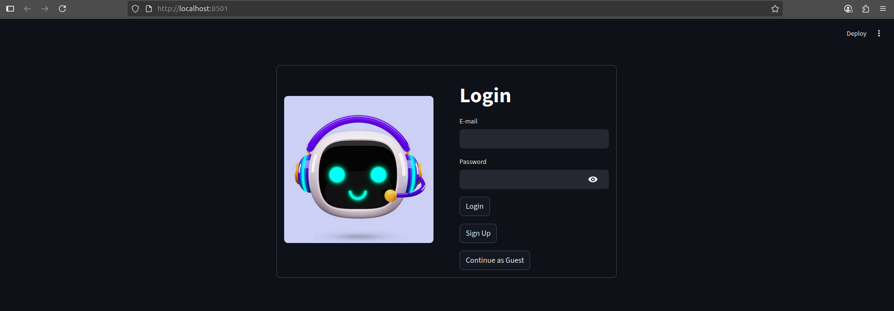
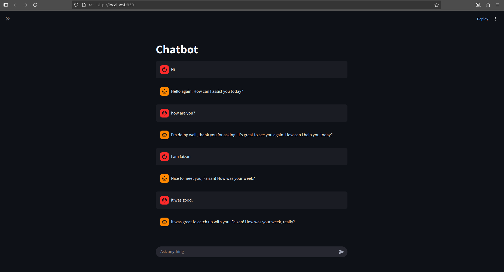

# LangGraph Chatbot (Streamlit Frontend)

This is a chatbot is utilizing Open source LLM quantized format of original Llama-3.2-1B of name `Llama-3.2-1B-Instruct-IQ3_M.gguf`, with a **Streamlit** interface for chatting in the browser.

It features an intelligent router to decide when to perform a web search for up-to-date information and saves conversation history so you can pick up where you left off.

## GUI


---

## Features

*   **Persistent Conversation History**: Use MongoDB to persist the chatting.
*   **By defualt Open source GGUF Llama-3.2-1B LLM**: Uses Quanitized Llama-3.2 LLM for generating high-quality, conversational responses.
*   **Gemini API based**: Uses Gemini API for generating high-quality, conversational responses.
*   **Simple Web Interface**: A clean and simple chat interface built with Streamlit.
*   **Local Network Access**: Can be accessed from other devices on the same local network.

---

## Installation

1.  **Clone the repository**

    ```bash
    https://github.com/muhammad-faizan-122/chatbot.git
    cd chatbot
    ```

2.  **Install dependencies**
    ```bash
    pip install -r requirements.txt
    ```


## Usage

Run the chatbot locally:

```bash
streamlit run app.py
```

You’ll see something like:

```
Local URL: http://localhost:8501
Network URL: http://192.168.x.x:8501
```

Open the **Local URL** if you’re using the same machine.
Open the **Network URL** on other devices connected to the same Wi-Fi/LAN.

---

## Access from Local Network

If you want other devices in your network to access it:

```bash
streamlit run app.py --server.address 0.0.0.0 --server.port 8501
```

Then visit:

```
http://<your-lan-ip>:8501
```

Example:

```
http://192.168.0.101:8501
```

### Notes:

*   Make sure your firewall allows inbound TCP on port **8501**.
*   Some routers block device-to-device communication (AP isolation).
*   This app is not secured with authentication — don’t expose it to the public internet.

---

## Limitations

*   Not optimized for heavy production workloads.
*   The default persistence is in-memory or local; for scaled deployment, a more robust database would be needed.

---